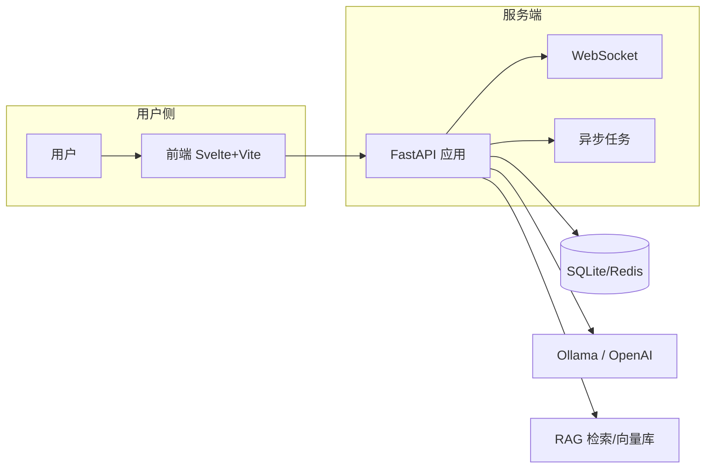
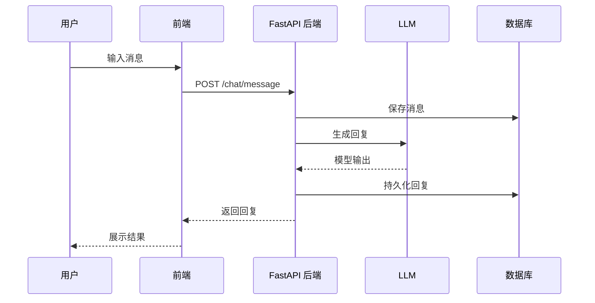
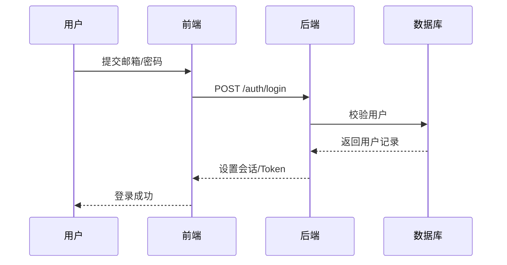

# Open WebUI 项目说明

## 架构设计

Open WebUI 采用前后端分离的模块化架构：



前端基于 Svelte/Vite 构建，提供组件化 UI、路由与 PWA 支持。后端由 FastAPI 驱动，提供 REST 和 WebSocket 接口，通过 SQLAlchemy 管理数据库，并借助插件系统对接多种 LLM 推理服务与检索引擎。

## 前端模块

| 目录 | 说明 |
|------|------|
| `src/routes` | 页面级路由定义，组织应用导航与布局 |
| `src/lib/components` | 可复用的 Svelte 组件，如聊天窗口、上传控件等 |
| `src/lib/stores` | Svelte store 状态管理，维护用户会话、设置等全局状态 |
| `src/lib/api` | 封装与后端交互的 fetch/WS 方法 |

## 后端模块

| 模块 | 位置 | 说明 |
|------|------|------|
| 应用入口 | `open_webui/main.py` | 创建 FastAPI 应用、挂载中间件与静态资源，注册所有路由与 WebSocket 事件 |
| 配置管理 | `open_webui/config.py`、`open_webui/env.py` | 读取环境变量及数据库中的持久化配置，支持动态更新 |
| 路由层 | `open_webui/routers/*` | 按功能拆分的 API 模块：`auths` 负责认证，`chats` 管理会话，`retrieval` 提供向量检索，`files`/`images` 支持多媒体处理等 |
| 数据模型 | `open_webui/models/*` | SQLAlchemy ORM 定义数据库表结构，如 `users`、`chats`、`messages`、`files` 等 |
| 异步任务 | `open_webui/tasks.py` | 基于 `asyncio` 与 Redis 的分布式任务队列，支持任务创建、查询与取消 |
| 检索模块 | `open_webui/retrieval/*` | 封装嵌入、重排与向量存储逻辑，支撑 RAG 流程 |
| WebSocket | `open_webui/socket/*` | 提供实时事件推送与长连接聊天能力 |
| 工具与插件 | `open_webui/functions.py`、`open_webui/utils/*` | 自定义函数、日志、审计及第三方服务集成 |

## 核心数据结构

### 用户、会话与消息

| 模型 | 说明 |
|------|------|
| `User` | 用户信息、角色及个性化设置 |
| `Chat` | 会话元数据，与多条 `Message` 关联 |
| `Message` | 消息内容，支持父子消息与附件/表情反应 |

```python
class Chat(Base):
    id = Column(Text, primary_key=True)
    title = Column(Text)
    user_id = Column(Text, ForeignKey("users.id"))
    messages = relationship("Message", back_populates="chat")

class Message(Base):
    id = Column(Text, primary_key=True)
    chat_id = Column(Text, ForeignKey("chats.id"))
    user_id = Column(Text)
    parent_id = Column(Text, nullable=True)
    content = Column(Text)
    data = Column(JSON, nullable=True)
    chat = relationship("Chat", back_populates="messages")
```

### 文件与检索

| 模型 | 说明 |
|------|------|
| `File` | 存储上传的原始文件及其元数据 |
| `Knowledge` | 文档切片后的向量及来源信息，用于 RAG |

## 时序图

### 消息交互



### 登录流程



## 运行脚本

项目提供多种脚本以支持开发、构建与测试：

```json
"scripts": {
  "dev": "npm run pyodide:fetch && vite dev --host",
  "build": "npm run pyodide:fetch && vite build",
  "lint": "npm run lint:frontend ; npm run lint:types ; npm run lint:backend",
  "test:frontend": "vitest --passWithNoTests"
}
```

## 小结

本文档详细介绍了 Open WebUI 的架构与前后端模块划分，给出了关键数据模型和典型交互流程，可作为团队理解与扩展项目的参考。
